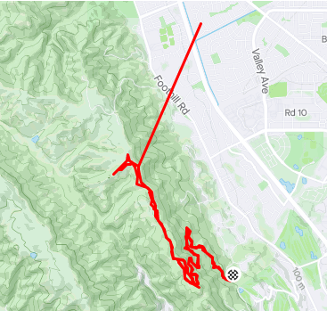

# Strava Cleaner

Sometimes when I try to track my bike rides using Strava, I get these random lines. I am not sure what causes these, but they're very annoying. This script aims to solve this problem.

## Tools

- xmltodict

## Installation

`TODO`

## How to use

1. Put a gpx file named `uncleanride.gpx` in the root directory

2. Run the script with `./cleaner.py`

3. Script will output the erranous longitude
